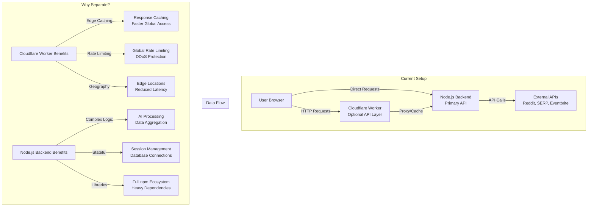

# Architecture Overview: Backend vs Cloudflare Worker

## The Reality Check

**Current State**: You have BOTH systems but they're doing the SAME thing - redundant.

**Options**:

1. **Kill the Worker** - Just use Node.js backend (simpler)
2. **Use Worker as CDN** - Cache responses, proxy to Node.js
3. **Split Responsibilities** - Worker for simple calls, Node.js for AI

**My Recommendation**: Kill the Worker for now. It's adding complexity without clear benefit for a single-user system.

---

_This document was generated with Verdent AI assistance._
