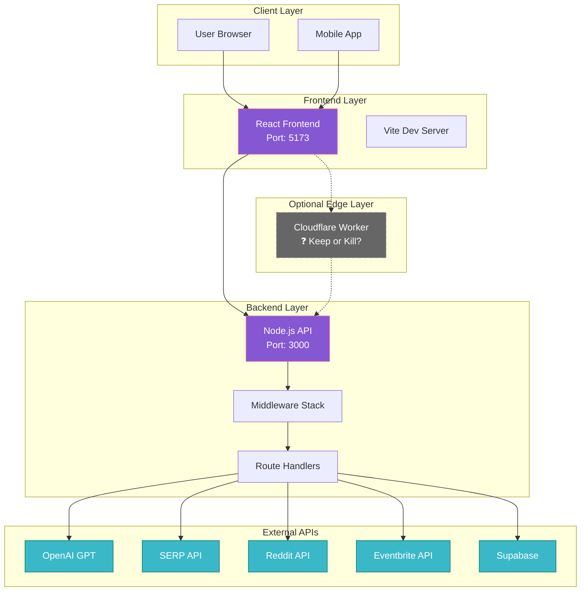
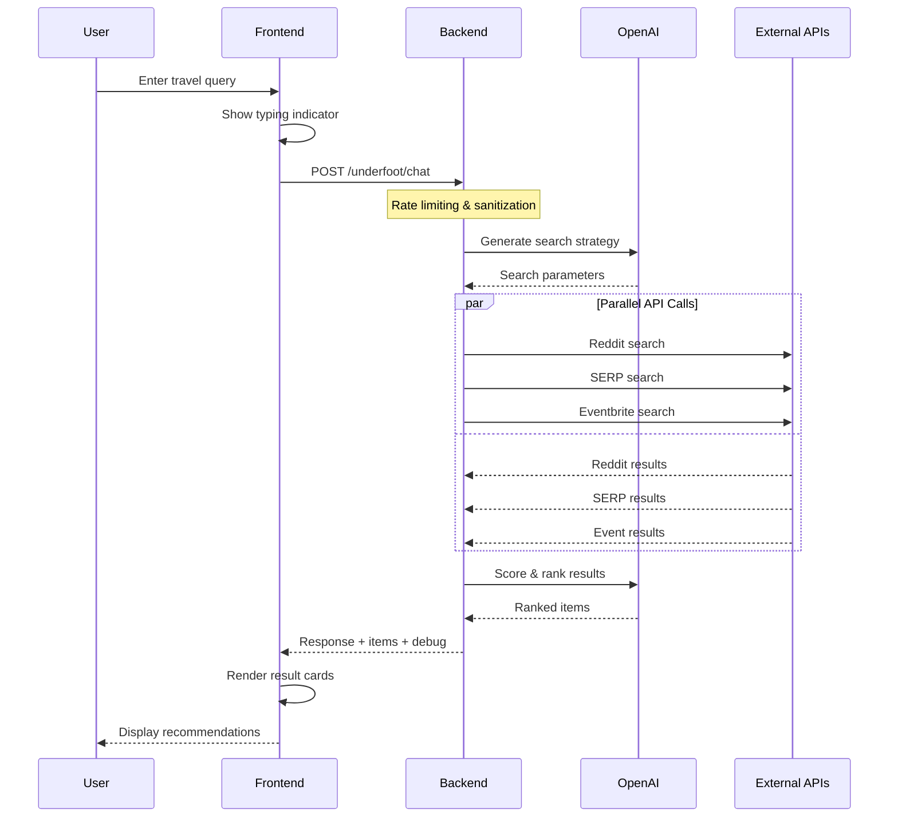
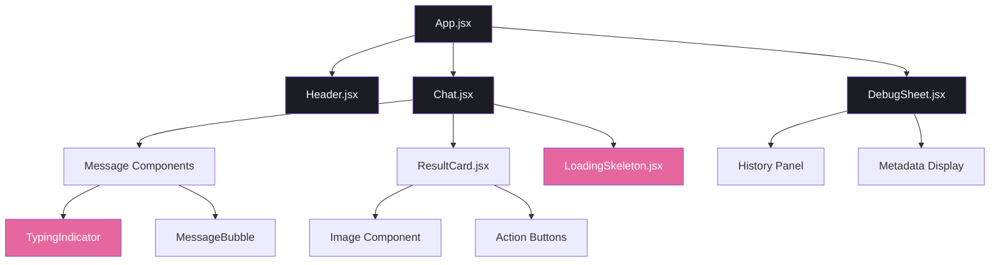
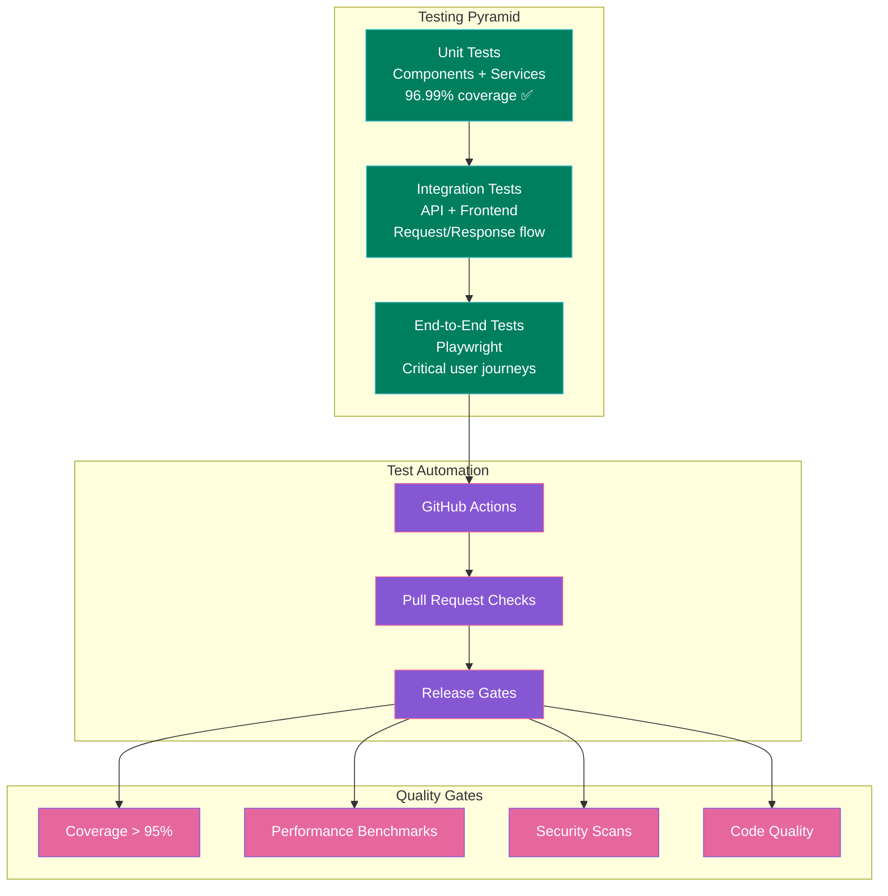
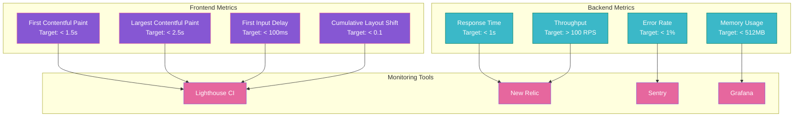
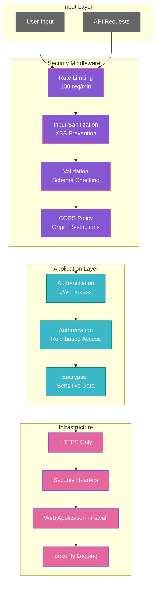

# Mermaid Diagrams: Underfoot System Documentation

## 1. System Architecture Overview



## 2. Data Flow: User Request to Response



## 3. Component Hierarchy



## 4. API Route Structure

```mermaid
graph LR
    subgraph "API Endpoints"
        ROOT[/]
        HEALTH[/health]
        CHAT[/underfoot/chat]
        NORM[/underfoot/normalize-location]
        SSE[/underfoot/chat?stream=true]
    end

    subgraph "Middleware Stack"
        CORS[CORS Handler]
        RATE[Rate Limiting]
        SAN[Input Sanitization]
        ERR[Error Handler]
    end

    subgraph "Route Handlers"
        SEARCH[Search Logic]
        AI[AI Integration]
        CACHE[Response Caching]
    end

    ROOT --> CORS
    HEALTH --> CORS
    CHAT --> CORS
    NORM --> CORS
    SSE --> CORS

    CORS --> RATE
    RATE --> SAN
    SAN --> SEARCH
    SAN --> AI
    SEARCH --> CACHE
    AI --> CACHE
    CACHE --> ERR

    classDef endpoint fill:#3BB8C8,stroke:#007F5F,color:#fff
    classDef middleware fill:#8657D3,stroke:#E6679E,color:#fff
    classDef handler fill:#E6679E,stroke:#8657D3,color:#fff

    class ROOT,HEALTH,CHAT,NORM,SSE endpoint
    class CORS,RATE,SAN,ERR middleware
    class SEARCH,AI,CACHE handler
```

## 5. Testing Strategy Overview



## 6. Deployment Pipeline

```mermaid
graph LR
    subgraph "Development"
        DEV[Local Dev]
        FEAT[Feature Branch]
        PR[Pull Request]
    end

    subgraph "CI/CD Pipeline"
        TEST[Run Tests]
        BUILD[Build Assets]
        VER[Version Bump]
        TAG[Create Tag]
    end

    subgraph "Deployment"
        STAGE[Staging Deploy]
        PROD[Production Deploy]
        ROLL[Rollback Ready]
    end

    DEV --> FEAT
    FEAT --> PR
    PR --> TEST
    TEST --> BUILD
    BUILD --> VER
    VER --> TAG
    TAG --> STAGE
    STAGE --> PROD
    PROD --> ROLL

    classDef dev fill:#666,stroke:#999,color:#fff
    classDef ci fill:#3BB8C8,stroke:#007F5F,color:#fff
    classDef deploy fill:#E6679E,stroke:#8657D3,color:#fff

    class DEV,FEAT,PR dev
    class TEST,BUILD,VER,TAG ci
    class STAGE,PROD,ROLL deploy
```



## 7. Performance Monitoring



## 8. Security Architecture



---

_This document was generated with Verdent AI assistance._
