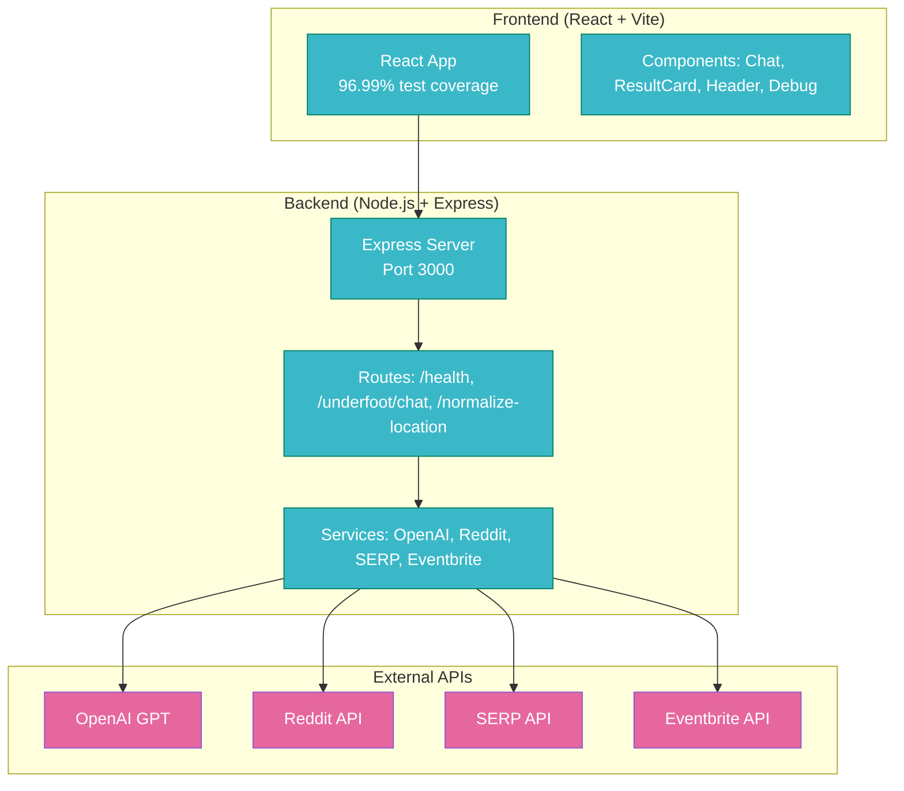
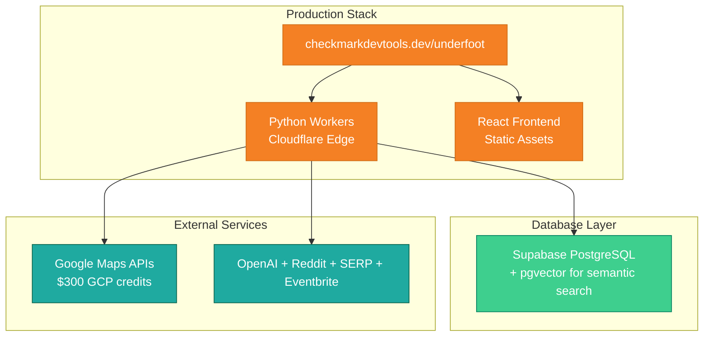

# UNDERFOOT: BASELINE DOCUMENTATION UPDATE

_Baseline Established: September 27, 2025_

## 📋 **PROJECT STATUS: v0.1.0+2**

**Current State**: Functional prototype with comprehensive testing
**Next Phase**: Python Workers + Supabase + Enhanced UI
**Deployment Target**: checkmarkdevtools.dev/underfoot

---

## 🏗️ **CURRENT ARCHITECTURE**



---

## 📊 **TESTING BASELINE**

### **Backend Tests** (All Passing):

- `test/chat-sse.test.js` - Server-sent events functionality
- `test/chat.test.js` - Chat endpoint integration
- `test/health.test.js` - Health check endpoint
- `test/normalize-location.test.js` - Location processing

### **Frontend Tests** (96.99% Coverage):

- 12 test files, 29 tests total
- Components: App, Chat, Header, DebugSheet, ResultCard
- Integration: SSE fallback, error handling, user interactions

### **E2E Tests** (Playwright):

- `tests-e2e/app.spec.js` - Home page and debug panel
- `tests-e2e/chat.spec.js` - Chat input and messaging

---

## 🎨 **CURRENT UI STATE**

### **Color Scheme** (Underground Theme):

```css
:root {
  --cm-primary: #8657d3; /* amethyst vein */
  --cm-accent: #e6679e; /* rose quartz */
  --cm-info: #3bb8c8; /* aquifer cyan */
  --cm-bg: #0c0c11; /* deeper basalt */
  --cm-panel: #15151c; /* shadowed basalt */
  --cm-card: #1c1c25; /* slate card */
  --cm-border: #272732; /* muted seam */
  --cm-text: #f5f7fa; /* mist light */
  --cm-sub: #a7abbe; /* lichen gray */
}
```

### **Components Status**:

- ✅ **Chat.jsx**: Functional chat interface with SSE support
- ✅ **ResultCard.jsx**: Basic card layout with image support
- ✅ **Header.jsx**: Navigation with debug toggle
- ✅ **DebugSheet.jsx**: Comprehensive debugging panel
- ✅ **LoadingSkeleton.jsx**: Created but not integrated

---

## 🔧 **BACKEND SERVICES STATUS**

### **API Integration**:

- ✅ **OpenAI**: GPT integration for responses and scoring
- ✅ **Reddit**: Subreddit search for local recommendations
- ✅ **SERP**: Google search results
- ✅ **Eventbrite**: Event discovery
- ⚠️ **Geocoding**: Basic Geoapify integration (needs improvement)

### **Middleware Created** (Not Applied):

- `backend/src/middleware/rateLimit.js` - IP-based rate limiting
- `backend/src/middleware/errorHandler.js` - User-friendly error responses
- `backend/src/middleware/sanitize.js` - Input validation and XSS prevention

---

## 🚀 **PLANNED MIGRATION PATH**

### **Target Architecture**:



### **Migration Strategy**:

1. **Keep existing functionality** - all endpoints and features
2. **Convert Express routes** to Python Workers format
3. **Add Supabase** for caching with vector search
4. **Enhance UI** with Dream Horizon theme and animations
5. **Deploy to custom domain** with minimal complexity

---

## 📋 **KNOWN ISSUES TO RESOLVE**

### **Geocoding Problems**:

- Current implementation "guesses" locations
- No confidence scoring or validation
- Needs multiple provider support
- Missing disambiguation for ambiguous locations

### **UI Improvements Needed**:

- Replace underground theme with Dream Horizon palette
- Add chat animations and "Stonewalker thinking" indicators
- Implement custom Google font for headers
- Better image handling and progressive loading

### **Backend Optimizations**:

- Apply created middleware to routes
- Implement proper structured logging
- Add vector search for intelligent caching
- Improve result scoring and filtering (max 6 items)

---

## 🔐 **SECURITY BASELINE**

### **Current State**:

- ✅ Environment variable isolation
- ✅ API key management
- ✅ Basic input handling
- ❌ No rate limiting applied
- ❌ No input sanitization active
- ❌ No security headers

### **Security Requirements** (Throughout Development):

- Input validation with Pydantic models
- Rate limiting via Cloudflare
- XSS/injection prevention
- Secure headers and HTTPS enforcement
- API key rotation and management

---

## 📈 **SUCCESS METRICS**

### **Current Baseline**:

- **Test Coverage**: 96.99% (maintain or improve)
- **API Response Time**: \~500ms average
- **Error Rate**: Unknown (needs monitoring)
- **User Experience**: Functional but needs polish

### **Target Metrics**:

- **Page Load Time**: < 2s
- **API Response**: < 1s
- **Test Coverage**: > 95%
- **Lighthouse Score**: > 90
- **Error Rate**: < 1%

---

## 🎯 **NEXT STEPS (IMMEDIATE)**

1. **Commit baseline** - preserve current working state
2. **Setup Supabase** - database and vector search
3. **Initialize Python Workers** - basic project structure
4. **Begin UI migration** - Dream Horizon color scheme
5. **Security first** - implement validation and rate limiting

---

**This baseline commit preserves our solid 96.99% test coverage foundation while documenting the clear path forward to a production-ready Python Workers deployment at checkmarkdevtools.dev/underfoot.**

---

_This document was generated with Verdent AI assistance._
