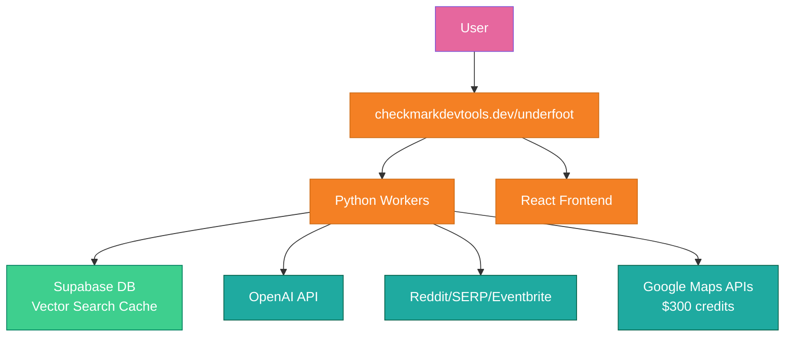

# UNDERFOOT DEVELOPMENT PLAN (SIMPLIFIED)

_Updated: September 27, 2025 | Target Launch: October 18, 2025_

## 🎯 **PROJECT GOALS**

- **Deploy**: checkmarkdevtools.dev/underfoot
- **Stack**: Python Workers + Supabase + React
- **Focus**: Beautiful UI, smart geocoding, vector search caching with learning
- **Timeline**: 3 weeks (Sep 27 - Oct 18), security throughout
- **New Elements**: TTL cleanup automation, vector search learning, deployment automation

---

## 📋 **PHASE 1: FOUNDATION** (Week 1: Jan 27 - Feb 3)

### 🗄️ **SUPABASE SETUP**

```
□ SB1: Create Supabase project
  - Setup database and authentication
  - Import existing schema from migrations/
  - Configure RLS policies

□ SB2: Vector search with learning & TTL cleanup
  - Setup pgvector extension
  - Create embeddings table with TTL expiration
  - Implement semantic search for location queries
  - Add user feedback collection (clicks, saves, ratings)
  - Cache API responses with smart TTL (event-based expiration)

□ SB3: Smart geocoding cache with cleanup
  - Store geocoded locations with confidence scores
  - Implement fuzzy location matching
  - Fix "guessing" problem with proper validation
  - Add automatic cleanup for expired geocoding data

□ SB4: Automated data cleanup system
  - Create cleanup functions (daily/weekly cron jobs)
  - Implement intelligent cleanup (preserve high-quality cache)
  - Set up monitoring and cost optimization
  - Add cleanup API endpoints for manual triggers
```

### 🐍 **PYTHON WORKERS CORE**

```
□ PY1: Basic setup + Pages Functions conversion
  - Convert Express routes to Cloudflare Pages Functions
  - Create src/main.py structure (future Python Workers)
  - Convert /health and /underfoot/chat endpoints
  - Set up SSE streaming for Pages Functions

□ PY2: External API integration with learning
  - OpenAI client (aiohttp) + embedding generation
  - Reddit API client with result scoring
  - SERP API integration with quality tracking
  - Eventbrite API client with event-based TTL
  - All with proper error handling + security

□ PY3: Smart agent with learning algorithms
  - Fix geocoder accuracy issues
  - Better location parsing and validation
  - Implement semantic query expansion (graveyards → haunted houses)
  - Smart result filtering with learning scores (keep 6 best)
  - User feedback collection and processing APIs
```

### 🎨 **UI POLISH (No Action Buttons)**

```
□ UI1: Dream Horizon color scheme
  - Light: Pearl White, Midnight Navy, Aurora Purple, Soft Teal
  - Dark: Deep Space, Pearl White, Aurora Purple
  - Full component updates

□ UI2: Chat interface animations
  - "Stonewalker thinking" animation
  - Smooth message transitions
  - Better typing indicators
  - Auto-scroll improvements

□ UI3: Enhanced ResultCard (simple)
  - Beautiful image display (from API sources)
  - Clean layout, no action buttons
  - Source badges and ratings
  - Progressive image loading

□ UI4: Custom Google Font
  - Choose and implement header font
  - Update typography scale
  - Ensure accessibility

□ UI5: Logo and branding
  - Integrate provided logos
  - Update favicon and icons
  - Consistent underground theme
```

---

## 🗺️ **PHASE 2: MAPS & OPTIMIZATION** (Week 2)

### 🗺️ **GOOGLE MAPS (LAST PRIORITY)**

```
□ MAP1: Setup Google Maps API ($300 GCP credits)
  - Enable Maps, Places, Geocoding APIs
  - Create map preview component
  - Show venue locations on results

□ MAP2: Maps integration
  - Interactive maps for venues
  - Geocoding service improvements
  - Cache geocoded results in Supabase
```

### 🧠 **SMART IMPROVEMENTS**

```
□ SMART1: Better geocoding with learning
  - Multiple geocoding providers
  - Confidence scoring with user feedback
  - Location disambiguation using embeddings
  - User feedback integration for geocoding accuracy

□ SMART2: Vector search with learning implementation
  - Embed search queries with OpenAI
  - Semantic similarity matching with quality scores
  - Smart cache hits for similar searches
  - User interaction tracking (clicks, saves, ratings)
  - Personalized result ranking
  - Performance optimization with A/B testing
```

---

## 🚀 **PHASE 3: DEPLOYMENT & POLISH** (Week 3: Feb 10 - Feb 17)

### 🌐 **DEPLOYMENT TO checkmarkdevtools.dev/underfoot**

```
□ DEPLOY1: Cloudflare Pages setup (ELI17 Senior+ approach)
  - Convert to Cloudflare Pages Functions (skip Docker/K8s drama)
  - Configure subdomain DNS: underfoot.checkmarkdevtools.dev
  - SSL certificate automatic via Cloudflare
  - Environment variables setup in Pages dashboard

□ DEPLOY2: Automated CI/CD pipeline
  - GitHub Actions: test → build → deploy (30-minute deployment)
  - Environment variables from GitHub Secrets
  - Automatic deployment on main branch push
  - Health checks and rollback on failure

□ DEPLOY3: Production optimization & monitoring
  - Cloudflare Analytics + Web Vitals tracking
  - Supabase cleanup cron jobs (daily 2 AM UTC)
  - Error tracking with structured logging
  - Performance monitoring (< 2s page load, < 500ms API)
  - Cost monitoring (target: $10-80/month total)
```

### 🔒 **SECURITY (ONGOING)**

```
□ SEC1: Input validation (Week 1)
  - Pydantic models for all inputs
  - XSS/injection prevention
  - Rate limiting via Cloudflare

□ SEC2: API security (Week 2)
  - Proper secrets management
  - Request authentication
  - Abuse prevention

□ SEC3: Security review (Week 3)
  - Audit all endpoints
  - Penetration testing
  - Security headers check
```

---

## 📊 **SIMPLIFIED ARCHITECTURE**



---

## 🎯 **IMMEDIATE PRIORITIES**

### **This Week**:

1. ✅ **Supabase setup** with vector search
2. ✅ **Python Workers basics** (health + chat endpoints)
3. ✅ **Dream Horizon UI** implementation
4. ✅ **Chat animations** and custom font
5. ✅ **Security from day 1** (validation, rate limiting)

### **Next Week**:

1. ✅ **Smart geocoding** improvements
2. ✅ **Image display** in results
3. ✅ **Vector search caching**
4. ✅ **Google Maps** integration (last)

### **Final Week**:

1. ✅ **Deploy to checkmarkdevtools.dev/underfoot**
2. ✅ **Performance optimization**
3. ✅ **Security review**
4. ✅ **Final polish**

---

## 🛠️ **TECHNICAL NOTES**

### **DNS/SSL Setup for checkmarkdevtools.dev/underfoot**:

```
1. Add CNAME record: underfoot.checkmarkdevtools.dev → your-worker.workers.dev
2. Custom domain in Cloudflare Workers dashboard
3. SSL auto-managed by Cloudflare
4. No complex setup needed
```

### **Vector Search Implementation**:

```python
# Supabase + pgvector for semantic cache
query_embedding = await embed_query(search_query)
cached_results = await supabase.rpc('search_similar_queries', {
    'query_embedding': query_embedding,
    'threshold': 0.8,
    'limit': 1
})
```

### **Results Limit**:

- Max 6 results per search (not "large")
- Quality over quantity
- Smart filtering and ranking

### **No Overengineering**:

- Single environment (production)
- ELI17 Senior+ deployment (30 minutes, not 30 hours)
- Focus on core functionality + learning intelligence
- Keep it fun, not enterprise
- TTL cleanup = no surprise bills

---

## 📅 **TIMELINE MILESTONES**

### Week 1 Deliverables (Oct 4, 2025):

- ✅ Supabase with TTL cleanup system
- ✅ Dream Horizon UI implementation
- ✅ Basic vector search with learning foundation
- ✅ Cloudflare Pages Functions conversion

### Week 2 Deliverables (Oct 11, 2025):

- ✅ Smart query expansion (graveyards → haunted houses)
- ✅ User feedback tracking and learning algorithms
- ✅ Google Custom Search API integration
- ✅ Automated cleanup cron jobs

### Week 3 Deliverables (Oct 18, 2025):

- ✅ Production deployment to checkmarkdevtools.dev/underfoot
- ✅ CI/CD pipeline with GitHub Actions
- ✅ Performance optimization and monitoring
- ✅ Learning analytics dashboard

**Ready for intelligent underground discovery!** 🚀

---

_This document was generated with Verdent AI assistance._
