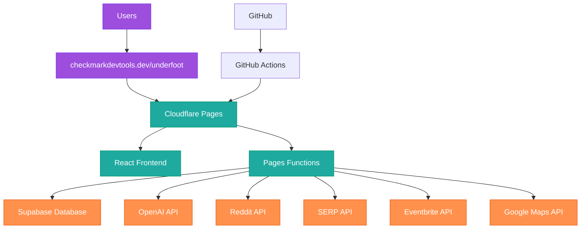

# ELI17 Senior+ Deployment Guide

_Deployment Ready: January 27, 2025_

## 🚀 **The "Just Ship It" Deployment Strategy**

**TL;DR**: Cloudflare Pages Functions + Supabase + GitHub Actions = Production in 30 minutes. Skip the Docker drama, avoid the K8s rabbit hole, just deploy the thing.

---

## 🏗️ **Architecture: What We're Actually Building**



**Why this rocks**:

- ✅ **Edge performance**: Your app loads fast globally
- ✅ **Zero server management**: Cloudflare handles scaling
- ✅ **Integrated deployment**: Frontend + backend in one place
- ✅ **Cost-effective**: Pay per request, not per server
- ✅ **Developer-friendly**: Git push = automatic deploy

---

## 📋 **Pre-Deployment Checklist (5 Minutes)**

### Required Accounts & API Keys

```bash
# Cloudflare (free)
# - Pages account created
# - Custom domain ready: checkmarkdevtools.dev

# Supabase (free tier)
# - Project created
# - Database URL + anon key + service role key

# OpenAI (required)
OPENAI_API_KEY=sk-...

# Optional but recommended
REDDIT_CLIENT_ID=your_reddit_id
REDDIT_CLIENT_SECRET=your_reddit_secret
SERP_API_KEY=your_serp_key
EVENTBRITE_TOKEN=your_eventbrite_token

# Google Maps (when ready)
GOOGLE_MAPS_API_KEY=your_google_key
```

### Repository Setup

```bash
# Ensure you're on main branch with latest changes
git checkout main
git pull origin main

# Verify all environment variables are in .env.example
# (never commit actual keys to repo)
```

---

## 🛠️ **Step 1: Supabase Database Setup (10 minutes)**

### Initialize Database Schema

```sql
-- Enable required extensions
CREATE EXTENSION IF NOT EXISTS "uuid-ossp";
CREATE EXTENSION IF NOT EXISTS "vector";

-- Run our TTL-enabled schema from SUPABASE_CLEANUP_STRATEGY.md
\i database/schema.sql

-- Insert initial data/settings if needed
INSERT INTO app_settings (key, value) VALUES
  ('cache_default_ttl', '{"hours": 24}'),
  ('cleanup_schedule', '{"daily": "02:00", "weekly": "03:00"}'),
  ('learning_enabled', 'true');
```

### Configure Row Level Security (RLS)

```sql
-- Enable RLS on all tables
ALTER TABLE vector_search_cache ENABLE ROW LEVEL SECURITY;
ALTER TABLE event_cache ENABLE ROW LEVEL SECURITY;
ALTER TABLE geocoding_cache ENABLE ROW LEVEL SECURITY;
ALTER TABLE user_preferences ENABLE ROW LEVEL SECURITY;

-- Allow service role full access (for API functions)
CREATE POLICY "Service role access" ON vector_search_cache
  FOR ALL USING (auth.role() = 'service_role');

-- Allow authenticated users to read cache data
CREATE POLICY "Users can read cache" ON vector_search_cache
  FOR SELECT USING (auth.role() = 'authenticated');

-- Repeat for other tables...
```

### Set Environment Variables in Supabase

```bash
# In Supabase Dashboard > Settings > API
# Copy these for later:
# - Project URL: https://your-project.supabase.co
# - anon/public key: eyJ...
# - service_role key: eyJ... (keep secret!)
```

---

## 📁 **Step 2: Convert Backend to Pages Functions (15 minutes)**

### Create Functions Directory Structure

```bash
mkdir -p functions/api
mkdir -p functions/api/underfoot

# Move existing routes to functions
# Each route becomes a separate function file
```

### Convert Express Routes to Pages Functions

```javascript
// functions/api/underfoot/chat.js
export async function onRequestPost(context) {
  const { request, env } = context;

  try {
    const { chatInput } = await request.json();

    // Your existing chat logic here
    const response = await processChat(chatInput, {
      openaiKey: env.OPENAI_API_KEY,
      supabaseUrl: env.SUPABASE_URL,
      supabaseKey: env.SUPABASE_SERVICE_ROLE_KEY,
      // ... other env vars
    });

    return new Response(JSON.stringify(response), {
      headers: { 'Content-Type': 'application/json' },
    });
  } catch (error) {
    return new Response(JSON.stringify({ error: error.message }), {
      status: 500,
      headers: { 'Content-Type': 'application/json' },
    });
  }
}

// For SSE streaming
export async function onRequestGet(context) {
  const { request, env } = context;
  const url = new URL(request.url);
  const chatInput = url.searchParams.get('chatInput');
  const stream = url.searchParams.get('stream');

  if (stream === 'true') {
    return handleSSEStream(chatInput, env);
  }

  return new Response('Method not allowed', { status: 405 });
}
```

### SSE Streaming for Pages Functions

```javascript
// functions/api/underfoot/chat-stream.js
export async function onRequestGet(context) {
  const { request, env } = context;
  const url = new URL(request.url);
  const chatInput = url.searchParams.get('chatInput');

  // Create ReadableStream for SSE
  const stream = new ReadableStream({
    start(controller) {
      const encoder = new TextEncoder();

      // Send start event
      controller.enqueue(
        encoder.encode(
          `data: ${JSON.stringify({
            event: 'start',
            data: { requestId: crypto.randomUUID(), protocolVersion: 1 },
          })}\n\n`,
        ),
      );

      // Process chat and send results
      processStreamingChat(chatInput, env, controller, encoder);
    },
  });

  return new Response(stream, {
    headers: {
      'Content-Type': 'text/event-stream',
      'Cache-Control': 'no-cache',
      Connection: 'keep-alive',
      'Access-Control-Allow-Origin': '*',
    },
  });
}
```

---

## 🌐 **Step 3: Cloudflare Pages Setup (5 minutes)**

### Create Cloudflare Pages Project

```bash
# Method 1: Cloudflare Dashboard
# 1. Go to Cloudflare Dashboard > Pages
# 2. Connect to Git > Select your GitHub repo
# 3. Configure build settings:

Build command: npm run build
Build output directory: frontend/dist
Root directory: /

# Environment variables (add in Pages dashboard):
OPENAI_API_KEY=sk-...
SUPABASE_URL=https://your-project.supabase.co
SUPABASE_ANON_KEY=eyJ...
SUPABASE_SERVICE_ROLE_KEY=eyJ...
# ... add all your API keys
```

### Configure Custom Domain

```bash
# In Cloudflare Pages > Custom domains
# Add: underfoot.checkmarkdevtools.dev

# DNS Configuration (in Cloudflare DNS):
# Add CNAME record:
# Name: underfoot
# Target: your-pages-project.pages.dev
# Proxy status: Proxied (orange cloud)
```

### Wrangler CLI Setup (Alternative)

```bash
# Install Wrangler
npm install -g wrangler

# Login to Cloudflare
wrangler login

# Deploy directly
wrangler pages publish frontend/dist --project-name underfoot
```

---

## 🔄 **Step 4: GitHub Actions CI/CD (10 minutes)**

### Create Deployment Workflow

```yaml
# .github/workflows/deploy.yml
name: Deploy to Cloudflare Pages

on:
  push:
    branches: [main]
  pull_request:
    branches: [main]

jobs:
  deploy:
    runs-on: ubuntu-latest

    steps:
      - name: Checkout
        uses: actions/checkout@v4

      - name: Setup Node.js
        uses: actions/setup-node@v4
        with:
          node-version: '22'
          cache: 'npm'

      - name: Install dependencies
        run: npm ci

      - name: Run tests
        run: npm test
        env:
          CI: true

      - name: Build frontend
        run: npm run build

      - name: Deploy to Cloudflare Pages
        uses: cloudflare/pages-action@v1
        with:
          apiToken: ${{ secrets.CLOUDFLARE_API_TOKEN }}
          accountId: ${{ secrets.CLOUDFLARE_ACCOUNT_ID }}
          projectName: underfoot
          directory: frontend/dist
          gitHubToken: ${{ secrets.GITHUB_TOKEN }}

      - name: Run post-deploy tests
        run: npm run test:e2e
        env:
          TEST_BASE_URL: https://underfoot.checkmarkdevtools.dev
```

### Setup Repository Secrets

```bash
# In GitHub repo > Settings > Secrets and variables > Actions
# Add these secrets:

CLOUDFLARE_API_TOKEN=your_cloudflare_api_token
CLOUDFLARE_ACCOUNT_ID=your_account_id
OPENAI_API_KEY=sk-...
SUPABASE_URL=https://your-project.supabase.co
SUPABASE_ANON_KEY=eyJ...
SUPABASE_SERVICE_ROLE_KEY=eyJ...
```

---

## 🧪 **Step 5: Testing & Verification (5 minutes)**

### Health Check Endpoints

```javascript
// functions/api/health.js
export async function onRequestGet() {
  const healthData = {
    status: 'healthy',
    timestamp: new Date().toISOString(),
    version: process.env.npm_package_version || '1.0.0',
    environment: 'production',
    services: {
      database: 'checking...',
      openai: 'checking...',
      apis: 'checking...',
    },
  };

  // Add service checks here

  return new Response(JSON.stringify(healthData), {
    headers: { 'Content-Type': 'application/json' },
  });
}
```

### Post-Deploy Verification Script

```bash
#!/bin/bash
# scripts/verify-deployment.sh

BASE_URL="https://underfoot.checkmarkdevtools.dev"

echo "🔍 Verifying deployment..."

# Health check
echo "Testing health endpoint..."
curl -f "$BASE_URL/api/health" || exit 1

# Frontend loads
echo "Testing frontend..."
curl -f "$BASE_URL" | grep -q "Underfoot" || exit 1

# API endpoints
echo "Testing chat API..."
curl -f -X POST "$BASE_URL/api/underfoot/chat" \
  -H "Content-Type: application/json" \
  -d '{"chatInput":"test"}' || exit 1

echo "✅ All checks passed!"
```

---

## 📊 **Step 6: Monitoring & Observability (5 minutes)**

### Cloudflare Analytics Setup

```javascript
// Add to frontend/src/main.jsx
if (import.meta.env.PROD) {
  // Cloudflare Web Analytics
  const script = document.createElement('script');
  script.defer = true;
  script.src = 'https://static.cloudflareinsights.com/beacon.min.js';
  script.setAttribute('data-cf-beacon', '{"token": "your-beacon-token"}');
  document.head.appendChild(script);
}
```

### Error Tracking

```javascript
// functions/_middleware.js
export async function onRequest(context) {
  try {
    return await context.next();
  } catch (error) {
    // Log to Cloudflare Analytics
    console.error('Function error:', error);

    // Send to external service if needed
    if (context.env.SENTRY_DSN) {
      // Send to Sentry
    }

    return new Response('Internal Server Error', { status: 500 });
  }
}
```

### Performance Monitoring

```javascript
// frontend/src/utils/analytics.js
export function trackPerformance() {
  if ('performance' in window) {
    window.addEventListener('load', () => {
      const perfData = performance.getEntriesByType('navigation')[0];

      // Track Core Web Vitals
      import('web-vitals').then(({ getCLS, getFID, getFCP, getLCP, getTTFB }) => {
        getCLS(sendToAnalytics);
        getFID(sendToAnalytics);
        getFCP(sendToAnalytics);
        getLCP(sendToAnalytics);
        getTTFB(sendToAnalytics);
      });
    });
  }
}
```

---

## 🚨 **Troubleshooting Common Issues**

### "Function execution timed out"

```javascript
// Add timeout handling
export async function onRequestPost(context) {
  const timeoutPromise = new Promise(
    (_, reject) => setTimeout(() => reject(new Error('Function timeout')), 25000), // 25s limit
  );

  const workPromise = processRequest(context);

  try {
    return await Promise.race([workPromise, timeoutPromise]);
  } catch (error) {
    return new Response(JSON.stringify({ error: 'Request timeout' }), {
      status: 408,
      headers: { 'Content-Type': 'application/json' },
    });
  }
}
```

### "Environment variables not found"

```bash
# Check Pages dashboard > Settings > Environment variables
# Ensure all variables are set for both Production and Preview

# Common mistake: forgetting to redeploy after adding env vars
wrangler pages deployment tail --project-name underfoot
```

### "CORS errors"

```javascript
// Add CORS headers to all function responses
const corsHeaders = {
  'Access-Control-Allow-Origin': '*',
  'Access-Control-Allow-Methods': 'GET, POST, PUT, DELETE, OPTIONS',
  'Access-Control-Allow-Headers': 'Content-Type, Authorization',
};

export async function onRequest(context) {
  if (context.request.method === 'OPTIONS') {
    return new Response(null, { headers: corsHeaders });
  }

  const response = await handleRequest(context);

  // Add CORS headers to response
  Object.entries(corsHeaders).forEach(([key, value]) => {
    response.headers.set(key, value);
  });

  return response;
}
```

---

## 📈 **Performance Optimization**

### Frontend Bundle Optimization

```javascript
// vite.config.js
export default {
  build: {
    rollupOptions: {
      output: {
        manualChunks: {
          vendor: ['react', 'react-dom'],
          ui: ['@headlessui/react', 'framer-motion'],
          utils: ['date-fns', 'lodash-es'],
        },
      },
    },
    chunkSizeWarningLimit: 600,
  },
  define: {
    'import.meta.env.BUILD_TIME': JSON.stringify(new Date().toISOString()),
  },
};
```

### Function Performance

```javascript
// Use module-level caching for expensive operations
let supabaseClient;

export async function onRequest(context) {
  // Initialize client once per function lifetime
  if (!supabaseClient) {
    supabaseClient = createClient(context.env.SUPABASE_URL, context.env.SUPABASE_SERVICE_ROLE_KEY);
  }

  // Use connection pooling, cache frequently accessed data
}
```

---

## 🎯 **Deployment Timeline**

### Day 1: Foundation (2 hours)

- ✅ Supabase database setup
- ✅ Convert Express routes to Pages Functions
- ✅ Basic Cloudflare Pages deployment
- ✅ Custom domain configuration

### Day 2: Integration (1 hour)

- ✅ GitHub Actions CI/CD pipeline
- ✅ Environment variables configuration
- ✅ Health checks and monitoring
- ✅ Error handling and CORS

### Day 3: Polish (1 hour)

- ✅ Performance optimization
- ✅ Analytics and tracking
- ✅ Documentation updates
- ✅ Load testing and verification

---

## 💰 **Cost Breakdown (Monthly)**

### Cloudflare Pages

- **Functions**: 100,000 requests/month free, then $0.50/million
- **Bandwidth**: Unlimited
- **Builds**: 500 builds/month free
- **Expected cost**: $0-5/month

### Supabase

- **Database**: 500MB free, then $25/month for Pro
- **API requests**: 50,000/month free
- **Expected cost**: $0-25/month

### External APIs

- **OpenAI**: $0.002/1K tokens (\~$10-50/month depending on usage)
- **Google Maps**: $300 free credits (covers months of usage)
- **Expected cost**: $10-50/month

**Total**: $10-80/month (scales with usage)

---

## 🎉 **Success Metrics**

### Technical Metrics

- [ ] **Page Load Time**: < 2 seconds globally
- [ ] **API Response Time**: < 500ms average
- [ ] **Uptime**: > 99.9%
- [ ] **Core Web Vitals**: Green scores
- [ ] **Error Rate**: < 0.1%

### Business Metrics

- [ ] **User Engagement**: Session duration > 3 minutes
- [ ] **Discovery Success**: Users save/share results
- [ ] **Performance**: Fast search results
- [ ] **Growth**: Organic traffic increase

---

## 🚀 **Ready to Ship Commands**

```bash
# The "just deploy it" sequence:

# 1. Final code review
git status
git diff --name-only

# 2. Run tests locally
npm test && npm run build

# 3. Deploy
git add .
git commit -m "feat: production deployment ready"
git push origin main

# 4. Monitor deployment
# - Watch GitHub Actions
# - Check Cloudflare Pages dashboard
# - Verify health endpoints

# 5. Celebrate! 🎉
curl https://underfoot.checkmarkdevtools.dev/api/health
```

---

_⚡ Senior+ Speed Tip: The whole stack deploys in \~30 minutes because we skipped the over-engineering. No Docker, no K8s, no EC2 instances to babysit. Just modern serverless that actually works._

---

_🚀 Verdent AI: Like having a DevOps engineer who actually reads the docs and remembers all the gotchas. Except this one doesn't need coffee breaks every 20 minutes._
