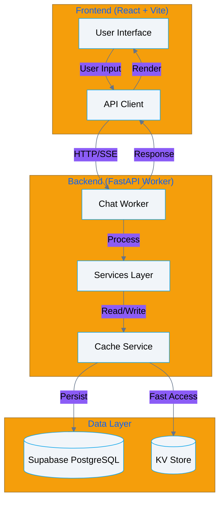
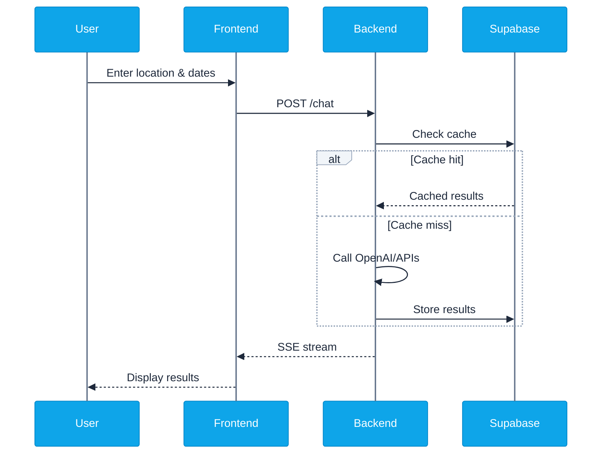
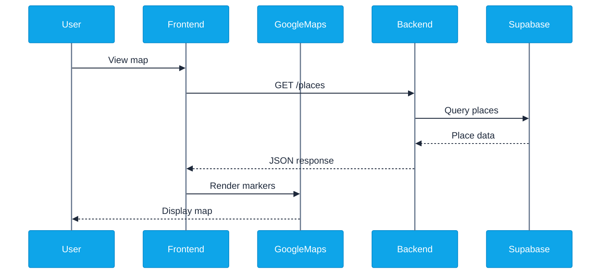

# Backend Integration Plan

## Current State

### ✅ Complete

- Python FastAPI backend with 7 services
- Google Maps API integration
- Pydantic models and validation
- Structured logging
- Test infrastructure (20% coverage)
- Frontend React app (96.99% coverage)
- Supabase database schema

### ❌ Missing

- Backend ↔ Supabase connection
- Frontend ↔ Backend API integration
- End-to-end data flow
- Production deployment configuration

## Integration Architecture



## Phase 1: Backend-Supabase Integration

### 1.1 Database Client Setup

**File**: `backend/src/services/supabase_service.py`

```python
from supabase import create_client, Client
from src.config.settings import get_settings

def get_supabase() -> Client:
    settings = get_settings()
    return create_client(
        settings.supabase_url,
        settings.supabase_service_role_key
    )
```

### 1.2 Cache Service Integration

**File**: `backend/src/services/cache_service.py`

**Actions**:

- Add Supabase client to cache service
- Implement persistent cache reads/writes
- Fallback to KV if Supabase unavailable

**Tables Used**:

- `cache_entries` - Chat response cache
- `search_results` - Place/event data cache

### 1.3 Vector Search Integration

**File**: `backend/src/services/search_service.py`

**Actions**:

- Connect to Supabase vector tables
- Implement similarity search
- Cache vector embeddings

**Tables Used**:

- `place_embeddings` - Vector embeddings for places
- `event_embeddings` - Vector embeddings for events

## Phase 2: Frontend-Backend Integration

### 2.1 API Client Setup

**File**: `frontend/src/services/api.ts`

```typescript
const API_BASE = import.meta.env.VITE_API_BASE || 'http://localhost:8000';

export async function sendChatMessage(message: string) {
  const response = await fetch(`${API_BASE}/chat`, {
    method: 'POST',
    headers: { 'Content-Type': 'application/json' },
    body: JSON.stringify({ message }),
  });
  return response.json();
}
```

### 2.2 SSE Stream Integration

**File**: `frontend/src/services/sse.ts`

```typescript
export function connectSSE(message: string, onMessage: (data: any) => void) {
  const eventSource = new EventSource(
    `${API_BASE}/chat/stream?message=${encodeURIComponent(message)}`,
  );

  eventSource.onmessage = (event) => {
    onMessage(JSON.parse(event.data));
  };

  return () => eventSource.close();
}
```

### 2.3 Chat Component Updates

**File**: `frontend/src/components/ChatInterface.tsx`

**Actions**:

- Replace mock data with API calls
- Implement SSE streaming
- Handle loading/error states
- Update UI with real results

## Phase 3: Data Flow Implementation

### 3.1 Chat Request Flow



### 3.2 Map Integration Flow



## Phase 4: Testing & Validation

### 4.1 Integration Tests

**File**: `backend/tests/integration/test_full_flow.py`

```python
async def test_chat_to_database_flow():
    # Send chat message
    response = await client.post("/chat", json={
        "message": "Cool places in Portland OR"
    })

    # Verify Supabase write
    result = supabase.table("cache_entries").select("*").execute()
    assert len(result.data) > 0
```

### 4.2 E2E Tests

**File**: `frontend/test/e2e/chat-flow.spec.ts`

```typescript
test('complete chat flow', async ({ page }) => {
  await page.goto('/');
  await page.fill('[data-testid="chat-input"]', 'Portland OR');
  await page.click('[data-testid="send-button"]');

  // Wait for results
  await page.waitForSelector('[data-testid="result-card"]');

  // Verify map markers
  const markers = await page.locator('.map-marker').count();
  expect(markers).toBeGreaterThan(0);
});
```

## Phase 5: Deployment

### 5.1 Backend - Cloudflare Workers

**File**: `backend/wrangler.toml`

**Actions**:

- Set production secrets via `wrangler secret put`
- Configure routes for checkmarkdevtools.dev
- Deploy with `wrangler deploy`

### 5.2 Frontend - Cloudflare Workers

**File**: `frontend/wrangler.toml` (create)

**Actions**:

- Configure build: `npm run build`
- Set up Workers Sites for static assets
- Configure environment variables
- Deploy with `wrangler deploy`

### 5.3 Environment Configuration

**Backend Production Secrets**:

```bash
wrangler secret put OPENAI_API_KEY
wrangler secret put GOOGLE_MAPS_API_KEY
wrangler secret put SERPAPI_KEY
wrangler secret put REDDIT_CLIENT_ID
wrangler secret put REDDIT_CLIENT_SECRET
wrangler secret put EVENTBRITE_TOKEN
wrangler secret put SUPABASE_URL
wrangler secret put SUPABASE_SERVICE_ROLE_KEY
```

**Frontend Environment**:

```env
VITE_API_BASE=https://api.checkmarkdevtools.dev/underfoot
VITE_GOOGLE_MAPS_API_KEY=<production-key>
```

## Implementation Checklist

### Backend

- [ ] Create Supabase service client
- [ ] Update cache service for Supabase persistence
- [ ] Implement vector search queries
- [ ] Add integration tests
- [ ] Configure wrangler secrets

### Frontend

- [ ] Create API client service
- [ ] Implement SSE streaming
- [ ] Update ChatInterface component
- [ ] Connect GoogleMapView to backend
- [ ] Add E2E tests
- [ ] Configure production env vars

### Database

- [ ] Verify Supabase tables exist
- [ ] Create indexes for performance
- [ ] Set up Row Level Security (RLS)
- [ ] Configure service role access

### Deployment

- [ ] Deploy backend to Cloudflare Workers
- [ ] Deploy frontend to Cloudflare Pages
- [ ] Configure custom domain routing
- [ ] Set up monitoring/logging
- [ ] Test production flow

## Success Criteria

- ✅ User can send chat message from frontend
- ✅ Backend processes request and queries APIs
- ✅ Results are cached in Supabase
- ✅ Frontend displays results with map markers
- ✅ SSE streaming works in production
- ✅ Vector search returns relevant results
- ✅ E2E tests pass for critical flows
- ✅ Production deployment is stable

## Notes

- Supabase CLI is limited - all schema changes done manually via dashboard
- Backend is already Workers-compatible (FastAPI on Workers)
- Frontend needs `VITE_API_BASE` updated for production
- Use service role key for backend (bypasses RLS)
- Consider rate limiting on production endpoints
