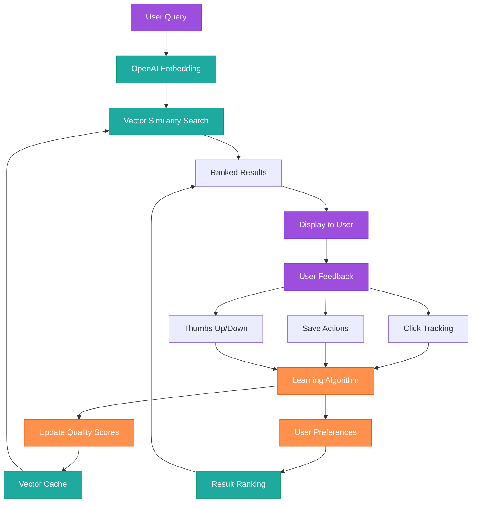

# Vector Search Learning Implementation

_Learning System Design: January 27, 2025_

## 🧠 **ELI17 Senior+: Making Vector Search Actually Smart**

**TL;DR**: Your search gets better every time someone uses it. Track clicks, saves, thumbs up/down → better results for everyone. OpenAI embeddings + user feedback = search that learns what "underground" actually means.

---

## 📊 **Learning Architecture Overview**



---

## 🎯 **Learning Data Collection**

### Frontend Tracking Components

```typescript
// src/components/ResultCard.jsx
import { trackUserInteraction } from '../utils/analytics';

interface ResultCardProps {
  result: SearchResult;
  searchId: string;
  position: number;
}

export function ResultCard({ result, searchId, position }: ResultCardProps) {
  const handleClick = () => {
    // Track click with context
    trackUserInteraction({
      type: 'result_click',
      searchId,
      resultId: result.source_id,
      position,
      source: result.source,
      timestamp: Date.now()
    });

    // Open result
    window.open(result.url, '_blank');
  };

  const handleSave = async () => {
    await trackUserInteraction({
      type: 'result_save',
      searchId,
      resultId: result.source_id,
      position,
      source: result.source,
      timestamp: Date.now()
    });

    // Save to user's collection
    await saveResult(result);
  };

  const handleFeedback = async (isPositive: boolean) => {
    await trackUserInteraction({
      type: 'result_feedback',
      searchId,
      resultId: result.source_id,
      position,
      feedback: isPositive ? 'positive' : 'negative',
      timestamp: Date.now()
    });
  };

  return (
    <div className="result-card">
      <div onClick={handleClick} className="cursor-pointer">
        <h3>{result.name}</h3>
        <p>{result.description}</p>
        <div className="flex items-center justify-between mt-4">
          <span className="text-sm text-cm-sub">{result.source}</span>
          <div className="flex gap-2">
            <button
              onClick={(e) => { e.stopPropagation(); handleSave(); }}
              className="save-btn"
            >
              Save
            </button>
            <button
              onClick={(e) => { e.stopPropagation(); handleFeedback(true); }}
              className="thumbs-up"
            >
              👍
            </button>
            <button
              onClick={(e) => { e.stopPropagation(); handleFeedback(false); }}
              className="thumbs-down"
            >
              👎
            </button>
          </div>
        </div>
      </div>
    </div>
  );
}
```

### Analytics Collection System

```typescript
// src/utils/analytics.js
interface UserInteraction {
  type: 'result_click' | 'result_save' | 'result_feedback' | 'search_complete';
  searchId: string;
  resultId?: string;
  position?: number;
  source?: string;
  feedback?: 'positive' | 'negative';
  timestamp: number;
  sessionId?: string;
  userId?: string;
}

class LearningAnalytics {
  private interactions: UserInteraction[] = [];
  private sessionId = crypto.randomUUID();

  async trackUserInteraction(interaction: UserInteraction) {
    // Add session context
    const enrichedInteraction = {
      ...interaction,
      sessionId: this.sessionId,
      userId: await this.getUserId(),
      userAgent: navigator.userAgent,
      viewport: `${window.innerWidth}x${window.innerHeight}`,
    };

    // Store locally for offline support
    this.interactions.push(enrichedInteraction);
    localStorage.setItem('pending_interactions', JSON.stringify(this.interactions));

    // Send to backend (batch for performance)
    if (this.interactions.length >= 5 || interaction.type === 'search_complete') {
      await this.flushInteractions();
    }
  }

  private async flushInteractions() {
    if (this.interactions.length === 0) return;

    try {
      await fetch('/api/learning/interactions', {
        method: 'POST',
        headers: { 'Content-Type': 'application/json' },
        body: JSON.stringify({ interactions: this.interactions }),
      });

      // Clear successful interactions
      this.interactions = [];
      localStorage.removeItem('pending_interactions');
    } catch (error) {
      console.warn('Failed to send learning data:', error);
      // Keep interactions for retry
    }
  }

  // Send data on page unload
  constructor() {
    window.addEventListener('beforeunload', () => {
      if (this.interactions.length > 0) {
        // Use sendBeacon for reliable delivery
        navigator.sendBeacon(
          '/api/learning/interactions',
          JSON.stringify({ interactions: this.interactions }),
        );
      }
    });

    // Load any pending interactions from previous session
    const pending = localStorage.getItem('pending_interactions');
    if (pending) {
      this.interactions = JSON.parse(pending);
      this.flushInteractions();
    }
  }

  private async getUserId(): Promise<string | undefined> {
    // Anonymous user tracking (no PII)
    let userId = localStorage.getItem('anonymous_user_id');
    if (!userId) {
      userId = crypto.randomUUID();
      localStorage.setItem('anonymous_user_id', userId);
    }
    return userId;
  }
}

export const analytics = new LearningAnalytics();
export const trackUserInteraction = (interaction: UserInteraction) =>
  analytics.trackUserInteraction(interaction);
```

---

## 🧮 **Backend Learning Algorithms**

### Interaction Processing API

```javascript
// functions/api/learning/interactions.js
import { createClient } from '@supabase/supabase-js';

export async function onRequestPost(context) {
  const { request, env } = context;
  const { interactions } = await request.json();

  const supabase = createClient(env.SUPABASE_URL, env.SUPABASE_SERVICE_ROLE_KEY);

  try {
    // Process each interaction
    for (const interaction of interactions) {
      await processInteraction(interaction, supabase);
    }

    return new Response(JSON.stringify({ success: true }), {
      headers: { 'Content-Type': 'application/json' },
    });
  } catch (error) {
    console.error('Learning processing error:', error);
    return new Response(JSON.stringify({ error: error.message }), {
      status: 500,
      headers: { 'Content-Type': 'application/json' },
    });
  }
}

async function processInteraction(interaction, supabase) {
  switch (interaction.type) {
    case 'result_click':
      await updateResultScore(interaction, 0.1, supabase);
      await updateUserPreferences(interaction, 'click', supabase);
      break;

    case 'result_save':
      await updateResultScore(interaction, 0.3, supabase);
      await updateUserPreferences(interaction, 'save', supabase);
      break;

    case 'result_feedback':
      const score = interaction.feedback === 'positive' ? 0.2 : -0.2;
      await updateResultScore(interaction, score, supabase);
      await updateUserPreferences(interaction, 'feedback', supabase);
      break;

    case 'search_complete':
      await recordSearchSession(interaction, supabase);
      break;
  }
}
```

### Smart Result Scoring

```javascript
// Learning algorithm that improves result quality
async function updateResultScore(interaction, scoreBoost, supabase) {
  const { searchId, resultId, position, source } = interaction;

  // Find the cached search that generated this result
  const { data: cacheEntry } = await supabase
    .from('vector_search_cache')
    .select('*')
    .eq('id', searchId)
    .single();

  if (!cacheEntry) return;

  // Update result scores in the cached results
  const updatedResults = cacheEntry.results.map((result) => {
    if (result.source_id === resultId) {
      return {
        ...result,
        learning_score: (result.learning_score || 0) + scoreBoost,
        interaction_count: (result.interaction_count || 0) + 1,
        last_interaction: new Date().toISOString(),
      };
    }
    return result;
  });

  // Calculate new cache quality score
  const totalInteractions = updatedResults.reduce((sum, r) => sum + (r.interaction_count || 0), 0);
  const avgLearningScore =
    updatedResults.reduce((sum, r) => sum + (r.learning_score || 0), 0) / updatedResults.length;

  // Position bias: earlier results that get clicked are better
  const positionFactor = Math.max(0, 1 - position * 0.1);
  const qualityBoost = scoreBoost * positionFactor;

  // Update cache entry
  await supabase
    .from('vector_search_cache')
    .update({
      results: updatedResults,
      cache_score: Math.min(1.0, cacheEntry.cache_score + qualityBoost),
      user_feedback: {
        ...cacheEntry.user_feedback,
        total_interactions: totalInteractions,
        avg_learning_score: avgLearningScore,
        last_updated: new Date().toISOString(),
      },
    })
    .eq('id', searchId);

  // Update global result quality for similar searches
  await updateGlobalResultQuality(resultId, source, scoreBoost, supabase);
}
```

### User Preference Learning

```javascript
// Learn what each user likes for personalized results
async function updateUserPreferences(interaction, actionType, supabase) {
  const { userId, resultId, source } = interaction;

  if (!userId) return; // Skip for anonymous users

  // Find the result to extract features
  const { data: cacheEntry } = await supabase
    .from('vector_search_cache')
    .select('results')
    .eq('id', interaction.searchId)
    .single();

  const result = cacheEntry?.results?.find((r) => r.source_id === resultId);
  if (!result) return;

  // Extract learnable features
  const features = extractResultFeatures(result);

  // Update or create user preferences
  for (const [featureType, featureValue] of Object.entries(features)) {
    await supabase.from('user_preferences').upsert(
      {
        user_id: userId,
        preference_type: featureType,
        preference_data: {
          value: featureValue,
          source: source,
          action_type: actionType,
          weight: getActionWeight(actionType),
        },
        confidence_score: calculateConfidenceScore(actionType, featureValue),
        updated_at: new Date().toISOString(),
      },
      {
        onConflict: 'user_id,preference_type',
      },
    );
  }
}

function extractResultFeatures(result) {
  return {
    source_preference: result.source,
    underground_keywords: result.features?.undergroundKeywordHits || 0,
    content_type: classifyContentType(result),
    location_type: classifyLocationType(result),
    price_range: extractPriceRange(result),
    time_preference: extractTimePreference(result),
  };
}

function getActionWeight(actionType) {
  const weights = {
    click: 0.1,
    save: 0.3,
    feedback: 0.2,
  };
  return weights[actionType] || 0.1;
}
```

---

## 🔍 **Enhanced Search with Learning**

### Smart Result Ranking

```javascript
// Enhanced search that uses learning data
export async function searchWithLearning(queryText, location, userId, supabase, openai) {
  // Generate embedding for query
  const embedding = await generateEmbedding(queryText, openai);

  // Find similar cached searches
  const { data: similarSearches } = await supabase.rpc('search_similar_queries', {
    query_embedding: embedding,
    location_filter: location,
    threshold: 0.8,
    limit_results: 3,
  });

  // If we have good cached results, enhance them with learning
  if (similarSearches?.length > 0) {
    const bestMatch = similarSearches[0];

    // Apply user personalization if available
    let personalizedResults = bestMatch.cached_results;
    if (userId) {
      personalizedResults = await personalizeResults(personalizedResults, userId, supabase);
    }

    // Re-rank based on learning scores
    const rankedResults = rankResultsWithLearning(personalizedResults);

    return {
      results: rankedResults,
      source: 'enhanced_cache',
      learning_applied: true,
      cache_id: bestMatch.cache_id,
    };
  }

  // No cache hit - perform fresh search
  const freshResults = await performFreshSearch(queryText, location);

  // Store new search for future learning
  const { data: cacheEntry } = await supabase
    .from('vector_search_cache')
    .insert({
      query_text: queryText,
      query_embedding: embedding,
      location_normalized: location,
      results: freshResults,
      cache_score: 0.5, // Neutral starting score
      expires_at: calculateTTL(queryText),
    })
    .select()
    .single();

  return {
    results: freshResults,
    source: 'fresh_search',
    learning_applied: false,
    cache_id: cacheEntry.id,
  };
}
```

### Personalized Result Ranking

```javascript
async function personalizeResults(results, userId, supabase) {
  // Get user preferences
  const { data: preferences } = await supabase
    .from('user_preferences')
    .select('*')
    .eq('user_id', userId)
    .gte('confidence_score', 0.3); // Only use confident preferences

  if (!preferences?.length) return results;

  // Score each result based on user preferences
  const personalizedResults = results.map((result) => {
    let personalityScore = 0;
    const features = extractResultFeatures(result);

    for (const pref of preferences) {
      const featureValue = features[pref.preference_type];
      if (featureValue && pref.preference_data.value === featureValue) {
        personalityScore += pref.confidence_score * pref.preference_data.weight;
      }
    }

    return {
      ...result,
      personality_score: personalityScore,
      original_score: result.learning_score || 0,
    };
  });

  // Re-sort by combined score
  return personalizedResults.sort((a, b) => {
    const scoreA = a.original_score * 0.7 + a.personality_score * 0.3;
    const scoreB = b.original_score * 0.7 + b.personality_score * 0.3;
    return scoreB - scoreA;
  });
}

function rankResultsWithLearning(results) {
  return results
    .map((result) => ({
      ...result,
      // Combine multiple scoring factors
      final_score: calculateFinalScore(result),
    }))
    .sort((a, b) => b.final_score - a.final_score);
}

function calculateFinalScore(result) {
  const weights = {
    learning_score: 0.4, // How users interacted with this result
    underground_keywords: 0.2, // Matches our theme
    recency: 0.1, // How recent/relevant
    source_quality: 0.1, // Quality of the source
    image_present: 0.1, // Visual appeal
    interaction_count: 0.1, // How much engagement
  };

  return Object.entries(weights).reduce((score, [factor, weight]) => {
    const value = getFactorValue(result, factor);
    return score + value * weight;
  }, 0);
}
```

---

## 📈 **Learning Analytics Dashboard**

### Real-time Learning Metrics

```sql
-- Analytics view for monitoring learning performance
CREATE VIEW learning_analytics AS
SELECT
  DATE_TRUNC('day', created_at) as date,
  COUNT(*) as total_searches,
  AVG(cache_score) as avg_quality_score,
  COUNT(*) FILTER (WHERE cache_score > 0.7) as high_quality_searches,
  COUNT(*) FILTER (WHERE user_feedback IS NOT NULL) as searches_with_feedback,
  AVG(accessed_count) as avg_reuse_rate,
  AVG(
    CASE
      WHEN user_feedback->>'total_interactions' IS NOT NULL
      THEN (user_feedback->>'total_interactions')::INTEGER
      ELSE 0
    END
  ) as avg_interactions_per_search
FROM vector_search_cache
GROUP BY DATE_TRUNC('day', created_at)
ORDER BY date DESC;
```

### Learning Performance API

```javascript
// functions/api/learning/analytics.js
export async function onRequestGet(context) {
  const { env } = context;
  const supabase = createClient(env.SUPABASE_URL, env.SUPABASE_SERVICE_ROLE_KEY);

  const { data: analytics } = await supabase.from('learning_analytics').select('*').limit(30); // Last 30 days

  const { data: topQueries } = await supabase.rpc('get_top_performing_queries');
  const { data: userInsights } = await supabase.rpc('get_user_learning_insights');

  return new Response(
    JSON.stringify({
      daily_analytics: analytics,
      top_performing_queries: topQueries,
      user_insights: userInsights,
      learning_health: calculateLearningHealth(analytics),
    }),
    {
      headers: { 'Content-Type': 'application/json' },
    },
  );
}

function calculateLearningHealth(analytics) {
  if (!analytics?.length) return { status: 'unknown', score: 0 };

  const recent = analytics.slice(0, 7); // Last 7 days
  const avgQuality = recent.reduce((sum, day) => sum + day.avg_quality_score, 0) / recent.length;
  const feedbackRate =
    recent.reduce((sum, day) => sum + day.searches_with_feedback / day.total_searches, 0) /
    recent.length;
  const reuseRate = recent.reduce((sum, day) => sum + day.avg_reuse_rate, 0) / recent.length;

  const healthScore = avgQuality * 0.4 + feedbackRate * 0.3 + Math.min(reuseRate / 5, 1) * 0.3;

  return {
    status: healthScore > 0.7 ? 'excellent' : healthScore > 0.5 ? 'good' : 'needs_improvement',
    score: Math.round(healthScore * 100),
    metrics: {
      quality_score: Math.round(avgQuality * 100),
      feedback_rate: Math.round(feedbackRate * 100),
      reuse_rate: Math.round(reuseRate * 10) / 10,
    },
  };
}
```

---

## 🎯 **A/B Testing for Learning**

### Experimental Search Variants

```javascript
// Test different ranking algorithms
async function performExperimentalSearch(query, location, userId, supabase) {
  const experiment = await getActiveExperiment(userId, supabase);

  switch (experiment?.variant) {
    case 'learning_heavy':
      // 60% learning score, 40% base features
      return searchWithWeights({ learning: 0.6, features: 0.4 });

    case 'personalization_heavy':
      // 50% personalization, 30% learning, 20% base
      return searchWithWeights({ personalization: 0.5, learning: 0.3, features: 0.2 });

    case 'recency_bias':
      // Boost recent results
      return searchWithRecencyBoost(1.5);

    default:
      // Control group - standard algorithm
      return searchWithLearning(query, location, userId, supabase);
  }
}

async function getActiveExperiment(userId, supabase) {
  // Simple hash-based assignment for consistent user experience
  const userHash = await crypto.subtle.digest('SHA-256', new TextEncoder().encode(userId));
  const hashArray = Array.from(new Uint8Array(userHash));
  const hashHex = hashArray.map((b) => b.toString(16).padStart(2, '0')).join('');
  const bucket = parseInt(hashHex.substring(0, 2), 16) % 100;

  if (bucket < 25) return { variant: 'learning_heavy', bucket };
  if (bucket < 50) return { variant: 'personalization_heavy', bucket };
  if (bucket < 75) return { variant: 'recency_bias', bucket };
  return { variant: 'control', bucket };
}
```

---

## 🚀 **Implementation Timeline**

### Week 1: Foundation

- [ ] Basic interaction tracking (clicks, saves)
- [ ] Simple scoring algorithm
- [ ] Cache quality updates
- [ ] Frontend analytics integration

### Week 2: Intelligence

- [ ] User preference learning
- [ ] Personalized result ranking
- [ ] A/B testing framework
- [ ] Learning analytics dashboard

### Week 3: Optimization

- [ ] Advanced scoring algorithms
- [ ] Performance optimization
- [ ] Real-time learning updates
- [ ] Production monitoring

---

## 📊 **Success Metrics**

### Learning Effectiveness

- **Cache Hit Rate**: 60%+ for similar queries
- **Result Quality**: Average score improvement of 30% over 30 days
- **User Engagement**: 25%+ increase in saves/clicks per search
- **Personalization**: 15%+ improvement in user-specific rankings

### System Performance

- **Learning Latency**: < 100ms overhead for personalized search
- **Storage Efficiency**: Learning data < 10% of total cache size
- **Memory Usage**: < 50MB additional RAM for learning algorithms

---

_🎯 The learning element makes your search engine actually intelligent instead of just fast. Every click teaches it what "underground" means to real people._

---

_🧠 Verdent AI: The friend who pays attention to what you actually like instead of what you say you like. And remembers it all without being creepy about it._
